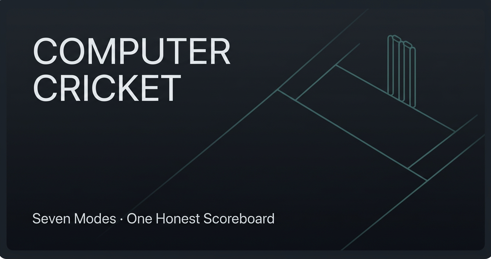

<picture>
  <source srcset="assets/hero-simulations.svg" type="image/svg+xml">
  
</picture>

<a href="https://gvaishanth.github.io/Velocity/">play.velocity</a> ·
<a href="https://gvaishanth.github.io/Computer-Cricket/game.html">play.cricket</a> ·
<a href="https://github.com/GVaishanth">github</a>

---

### Beginning

I build things to understand how they work.

Usually that starts with a game loop, a physics tick, or a state machine that needs to survive a crash. If I can make it run at 60fps in a browser tab with no backend, even better.

Most of what I ship is interactive — simulations, games, tools people can click — because feedback is immediate and honest. Either it feels good or it doesn't.

---

### What I enjoy

Building software end-to-end. Solving problems with real constraints — networking, timing, memory, frame budgets. Learning continuously, writing code I can come back to in six months, and deleting code that didn't earn its keep.

I keep coming back to a few areas:

- Interactive simulations and game systems
- Real-time multiplayer — WebRTC, host-authority, state sync
- Game AI — Minimax, Alpha-Beta, probabilistic outcomes
- Resilient systems — predict, checkpoint, recover
- Data analysis that turns messy input into something readable
- Motorsport and automotive engineering — mostly through simulation
- Small, polished tools that people actually want to play with

The automotive thread is deliberate but quiet. It's in Velocity, it's in how I think about telemetry and feedback loops. It's not a brand.

---

### How I think

Systems first. Start with the loop that has to run every frame, then build outward.

For multiplayer: one source of truth, deterministic where it matters, compensate everywhere else. Velocity runs 12 human constructors over PeerJS with host-authority results — not because it's trendy, because it's the simplest thing that stays correct when packets drop.

For state: assume the process will die. CRPapp checkpoints PDF reading state to Proto DataStore at 1 Hz, so a crash is a resume, not data loss. Same instinct shows up in the cricket games — match state is serializable, recoverable.

For UI: 60fps is a requirement, not a nice-to-have. Canvas, not DOM thrashing. Vanilla ES6, no framework tax for a simulation loop. If the interface feels like broadcast telemetry, good — that's the standard I hold myself to.

For AI: clean search beats clever heuristics, until it doesn't. Quantum Tic-Tac-Toe uses Minimax with Alpha-Beta — optimal, explainable, fast enough. Then layer probability on top with Qiskit so identical moves don't produce identical outcomes.

For data: clean first, visualize second, conclude last. Salary_Decoder and GroupDNA are both "take messy real-world input → normalize → find the signal" — same muscle, different domain.

Tools I reach for most: Python, JavaScript, Kotlin. WebRTC / PeerJS, HTML5 Canvas, Android / Material 3, Qiskit, NumPy / Pandas.

I write code to be read, delete code that isn't pulling weight, and ship early enough to get real feedback. "Cowboy Coding" in my bio isn't a joke about quality — it's about velocity.

---

### Projects

Two interactive simulations I keep coming back to. Both run in a browser, no install, no account.

 

**Velocity — F1 Constructor Championship**  
`JavaScript · Canvas · WebRTC`

A serverless Formula 1 management and racing sim. 60fps Canvas rendering, 22 subsystems, 52 files.

Host-authority P2P multiplayer for 12 drivers. Pit lane physics with per-team pit boxes. Thermal simulation — exceed 125°C and you DNF. VSC pacing sprints, red flags, driver rivalries, livery studio, R&D engineering, and a Hall of Glory with three historic title shootouts you can drop into directly.

Built with ES6 modules, pure CSS3, no backend. Runs from a static `index.html`.

<a href="https://gvaishanth.github.io/Velocity/">Play →</a> · <a href="https://github.com/GVaishanth/Velocity">Code →</a>

  

**Computer Cricket — Hand Cricket Club**  
`Python · JavaScript · PeerJS`

Hand cricket as a number-based simulation, in three forms: a Python CLI, a single-player web app, and a real-time multiplayer tournament platform.

Seven rule modes — Normal, Crazy, Insane, Mad, Noway, B10, Test — each changes what a matching number means: out, square your score, multiply, add, it varies. Single-player has difficulty levels, career stats, per-mode personal bests, and a luck quiz that nudges toss outcomes. Multiplayer runs IPL-style leagues with team drafts, live spectating with reactions, lobby chat, and a 30-match history.

52 JS functions for single-player, 91 for multiplayer. No server, PeerJS over WebRTC.

<a href="https://gvaishanth.github.io/Computer-Cricket/game.html">Play →</a> · <a href="https://github.com/GVaishanth/Computer-Cricket">Code →</a>

 

---

More builds — CRPapp · Quantum Tic-Tac-Toe · GroupDNA · Salary_Decoder

 

**[CRPapp](https://github.com/GVaishanth/CRPapp)** — Predictive Crash Resilience Framework. Android PDF workspace that monitors VM/OS health at 1 Hz, checkpoints reading state via Protocol Buffers, and recovers transparently after a crash. Chrome-style multi-tab, Material Design 3. `Kotlin · Android · Proto DataStore`

**[Quantum-Tic-Tac-Toe](https://github.com/GVaishanth/Quantum-Tic-Tac-Toe)** — Classical Tic-Tac-Toe with non-deterministic quantum state resolution. Qiskit circuits (H/Z/X gate encoding), multi-shot simulation, Minimax AI with Alpha-Beta pruning. `Python · Qiskit`

**[GroupDNA](https://github.com/GVaishanth/GroupDNA)** — WhatsApp Chat Analyzer. "Spotify Wrapped for your WhatsApp group." Message patterns, response times, silent streaks, personality archetypes. `Python · NumPy`

**[Salary_Decoder](https://github.com/GVaishanth/Salary_Decoder)** — Bangalore Tech Salary Decoder. 1,015-record EDA, cleaning messy CTC formats (LPA/rupees), role premiums, skill deltas, underpaid detection. `Python · Pandas · Seaborn`

---

### Lessons

What building these actually taught me, not what a blog post says:

1. **Real-time multiplayer is a state machine problem, not a networking problem.** Get the authority model right first — who decides the result — then make the network catch up. Velocity's host-authority + 1s state broadcast is boring engineering and it works. Clever prediction without authority drifts.

2. **Checkpoint before you need to recover.** CRPapp taught me this literally — monitor health continuously, save atomically, assume the process dies at the worst moment. Same principle applies to game state, tournament brackets, user profiles. If you can't resume, you didn't finish.

3. **Game feel is frame budget + input latency + feedback, in that order.** 60fps is non-negotiable. After that, input response. After that, audio/visual feedback that matches the mode — Computer Cricket has mode-specific commentary, boundary FX, win probability bars, because without feedback a number game feels dead.

4. **Constraints produce interesting games.** The seven cricket modes exist because "same number = out" gets boring fast. Change one rule — same = square your score, adjacent = out — and suddenly players think differently. Same with quantum Tic-Tac-Toe: non-deterministic resolution forces a different kind of strategy.

5. **Vanilla tools go further than people admit.** Velocity is 52 files of ES6 modules, no bundler, no framework, runs at 60fps on a phone. Computer Cricket's multiplayer is ~99 KB of vanilla JS over WebRTC. You don't need a stack to build something interactive, you need a tight loop.

6. **If it looks like a broadcast, people trust it.** Telemetry panels, timing towers, live tickers, reaction emojis — these aren't decoration in my projects, they're how players understand state at a glance. I keep coming back to broadcast UX because it compresses complex state into something readable in 200ms.

7. **Ship, then clean.** "Cowboy Coding" means get something playable fast, then refactor the systems that hurt. All four flagship repos have a v1 → v2 → v3 → v4 progression in the commit history. The first version is always messy. The fourth is where the architecture settles.

---

### Current work

  
    
  

Right now I'm focused on:

- Interactive simulations in vanilla JS — pushing Canvas performance, tighter physics, better broadcast UI
- Real-time multiplayer over WebRTC / PeerJS — lower latency state sync, better reconnection, larger rooms
- Game AI — stronger opponents without making them feel unfair, probabilistic systems
- Resilient Android architecture — fail-safe state management, Material 3
- Shipping small, polished tools regularly instead of one big perfect thing

The two widgets above are live — current build updates automatically, garage timeline shows real push dates across all 6 repos. No third-party stats services. Just my own SVG components, generated by GitHub Actions.

---

### Future ideas

Things I'm exploring, not promising:

- A deeper motorsport sim — pit strategy with tyre degradation models tied to real track temperature data, maybe a full season with driver market dynamics beyond what Velocity's "Silly Season" does now
- Real-time multiplayer games outside cricket — the tournament/lobby/spectate infrastructure from Computer Cricket is generic, it wants a second game
- Better AI opponents — the Minimax + Alpha-Beta in Quantum Tic-Tac-Toe is a start; I'd like to try MCTS for larger state spaces, maybe a racing AI that actually learns a line
- Android tooling around resilience — CRPapp proved the checkpoint/recover pattern works for document readers, the same engine could protect other kinds of long-running mobile sessions
- Data storytelling tools in the GroupDNA / Salary_Decoder vein — take messy real-world exports, turn them into something people screenshot and share. "Spotify Wrapped" as an interaction pattern, applied elsewhere

Mostly: keep building interactive things, keep them fast, keep them honest, keep shipping.

---

> *Championships are engineered.*
>  — Velocity

 

<a href="https://github.com/GVaishanth">github.com/GVaishanth</a>

  
AI · Android · Web — Open Source • Learning
  
<a href="#top">↑ top</a>

