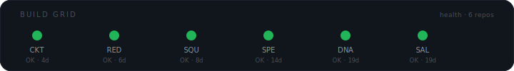

<div align="center">

<a name="top"></a>

<picture>
  <source media="(prefers-color-scheme: dark)" srcset="assets/hero-simulations.svg" type="image/svg+xml">
  
</picture>

<br>

<p>
<sub>
<a href="https://gvaishanth.github.io/Velocity/">play.velocity</a> ·
<a href="https://gvaishanth.github.io/Computer-Cricket/game.html">play.cricket</a> ·
<a href="https://github.com/GVaishanth">github</a>
</sub>
</p>

</div>

---

<!-- ═══════════════════════════════════════════════════════ -->
<!-- MISSION CONTROL                                         -->
<!-- ═══════════════════════════════════════════════════════ -->

<div align="center">

```
┌──────────────────────────────────────────────────────┐
│  SYSTEM ONLINE  ·  all subsystems nominal            │
│  60fps target locked  ·  no backend required         │
│  feedback loops: ACTIVE                              │
└──────────────────────────────────────────────────────┘
```

</div>

I build things to understand how they work. Usually that starts with a game loop, a physics tick, or a state machine that needs to survive a crash.

Most of what I ship is interactive — simulations, games, tools people can click — because feedback is immediate and honest. Either it feels good or it doesn't.

The thread that ties everything together is **feedback loops**. That's why I keep coming back to simulations. They force you to think in systems, in cycles, in consequences. You can't fake a simulation. If your physics are wrong, people notice in the first three seconds.

And I like that.

<div align="center">

</div>

---

<!-- ═══════════════════════════════════════════════════════ -->
<!-- THE GARAGE                                              -->
<!-- ═══════════════════════════════════════════════════════ -->

<div align="center">

```
▄▄▄▄▄▄▄▄▄▄▄▄▄▄▄▄▄▄▄▄▄▄▄▄▄▄▄▄▄▄▄▄▄▄▄▄▄▄▄▄▄▄▄▄▄▄▄▄▄▄▄▄▄▄▄
  THE GARAGE — what's on the wall
▀▀▀▀▀▀▀▀▀▀▀▀▀▀▀▀▀▀▀▀▀▀▀▀▀▀▀▀▀▀▀▀▀▀▀▀▀▀▀▀▀▀▀▀▀▀▀▀▀▀▀▀▀▀▀
```

</div>

> **`[01]`** Simulations & game systems → Canvas · ES6 · game loops
>
> **`[02]`** Real-time multiplayer → WebRTC · PeerJS · host-authority
>
> **`[03]`** Game AI → Minimax · Alpha-Beta · Qiskit
>
> **`[04]`** Resilient systems → Proto DataStore · checkpoint/recover
>
> **`[05]`** Data analysis → NumPy · Pandas · Seaborn
>
> **`[06]`** Motorsport engineering → telemetry · thermal models · strategy
>
> **`[07]`** Polished tools → things people actually want to play with

The automotive thread is deliberate but quiet. It's in Velocity, it's in how I think about telemetry and feedback loops. It's not a brand.

I don't enjoy building dashboards that no one reads or APIs that no one calls. I enjoy building things where someone's face changes when they see it work. A kid playing hand cricket against an AI and losing three times in a row before they figure out the pattern. A friend joining a 12-player lobby and realizing the physics feel right.

That's the metric that matters.

---

<!-- ═══════════════════════════════════════════════════════ -->
<!-- BLUEPRINTS                                              -->
<!-- ═══════════════════════════════════════════════════════ -->

<div align="center">


</div>

<br>

Two data packets orbit the architecture loop every 4.4 seconds. That's not decoration — it demonstrates the system is a closed loop. If any link breaks, the packets stop. **The animation is the proof the architecture works.**

<br>

<div align="center">

</div>

<br>

These aren't aspirational. They're what survived v1 → v4 refactors across every repo. I write code to be read, delete code that isn't pulling weight, and ship early enough to get real feedback. "Cowboy Coding" in my bio isn't a joke about quality — it's about velocity.

---

<!-- ═══════════════════════════════════════════════════════ -->
<!-- FEATURED BUILDS                                         -->
<!-- Apple-style product showcase cards                      -->
<!-- ═══════════════════════════════════════════════════════ -->

<div align="center">

`▸ FEATURED BUILDS — two simulations, zero installs, zero accounts`

<br>

<a href="https://github.com/GVaishanth/Velocity">

</a>

<br><br><br>

<a href="https://github.com/GVaishanth/Computer-Cricket">

</a>

<br><br><br>

<details>
<summary><b>Archive</b> — CRPapp · Quantum Tic-Tac-Toe · GroupDNA · Salary_Decoder</summary>
<br>

<a href="https://github.com/GVaishanth/CRPapp">

</a>

<br><br>

<a href="https://github.com/GVaishanth/Quantum-Tic-Tac-Toe">

</a>

<br><br>

<a href="https://github.com/GVaishanth/GroupDNA">

</a>

<br><br>

<a href="https://github.com/GVaishanth/Salary_Decoder">

</a>

</details>

</div>

---

<!-- ═══════════════════════════════════════════════════════ -->
<!-- BLACK BOX                                               -->
<!-- ═══════════════════════════════════════════════════════ -->

<div align="center">

```
╔══════════════════════════════════════════════════════════╗
║  BLACK BOX — DATA EXTRACTION COMPLETE                    ║
╠══════════════════════════════════════════════════════════╣
║  Source: v1→v4 refactors across 4 flagship repos         ║
║  Status: 7 findings recovered, 0 overwritten             ║
╚══════════════════════════════════════════════════════════╝
```

</div>

| `#01` | Multiplayer is a **state machine** problem, not a networking problem |
|:---:|:---|
| **Evidence** | Velocity's host-authority + 1s state broadcast. Boring engineering that works. Clever prediction without authority drifts. |

| `#02` | Checkpoint **before** you need to recover |
|:---:|:---|
| **Evidence** | CRPapp taught me this literally — monitor health continuously, save atomically, assume the process dies at the worst moment. If you can't resume, you didn't finish. |

| `#03` | Game feel = frame budget + input latency + feedback — **in that order** |
|:---:|:---|
| **Evidence** | 60fps non-negotiable. Then input response. Then audio/visual feedback. Without feedback a number game feels dead. |

| `#04` | Constraints produce interesting games |
|:---:|:---|
| **Evidence** | Seven cricket modes because "same number = out" gets boring fast. Change one rule and suddenly players think differently. |

| `#05` | Vanilla tools go further than people admit |
|:---:|:---|
| **Evidence** | Velocity: 52 ES6 modules, no bundler, no framework, 60fps on a phone. Cricket: ~99 KB of vanilla JS over WebRTC. |

| `#06` | If it looks like a broadcast, people trust it |
|:---:|:---|
| **Evidence** | Telemetry panels, timing towers, live tickers — not decoration, but how players understand complex state at a glance. |

| `#07` | Ship, then clean |
|:---:|:---|
| **Evidence** | "Cowboy Coding" means get something playable fast, then refactor the systems that hurt. The fourth version is where the architecture settles. |

<div align="center">
<br>

<br><br>

<br><br>

</div>

All three regenerate every 6 hours via GitHub Actions.

---

<!-- ═══════════════════════════════════════════════════════ -->
<!-- ON AIR                                                  -->
<!-- ═══════════════════════════════════════════════════════ -->

<div align="center">

```
◉ ON AIR — currently transmitting
```

</div>

| Session | Signal | Focus |
|:---|:---:|:---|
| Interactive simulations | `◉` | Canvas performance · tighter physics · better broadcast UI |
| Real-time multiplayer | `◉` | Lower latency · better reconnection · larger rooms |
| Game AI | `◉` | Stronger opponents · MCTS · probabilistic systems |
| Resilient Android | `◉` | Fail-safe state management · Material 3 |
| Small polished tools | `◉` | Ship regularly instead of one big perfect thing |

<div align="center">

```
▓▓▓▓▓▓▓▓▓▓▓▓▓░░░░░░░░░░░░░░ 6 repos · 5 languages · 244 days
```

<br>


<br><br>


</div>

<div align="center">

</div>

Every widget is self-generated. No third-party stat services. No JavaScript. No plugins.

---

<!-- ═══════════════════════════════════════════════════════ -->
<!-- HORIZON                                                 -->
<!-- ═══════════════════════════════════════════════════════ -->

<div align="center">

```
·  ·  ·  ·  →  →  →  →  →  →  →  →  →  →  →  →  →  ·  ·  ·  ·
H O R I Z O N
exploring, not promising
```

</div>

> **Deeper motorsport sim** — pit strategy with tyre degradation models tied to real track temperature data. Maybe a full season with driver market dynamics.

> **Multiplayer beyond cricket** — the tournament/lobby/spectate infrastructure from Computer Cricket is generic. It wants a second game.

> **Better AI opponents** — Minimax + Alpha-Beta is a start. I'd like to try MCTS for larger state spaces. Maybe a racing AI that actually learns a line.

> **Android resilience tooling** — CRPapp proved the checkpoint/recover pattern works. The same engine could protect other long-running mobile sessions.

> **Data storytelling tools** — take messy real-world exports, turn them into something people screenshot and share. "Spotify Wrapped" as an interaction pattern.

<div align="center">

```
·  ·  ·  ·  →  →  →  →  →  →  →  →  →  →  →  →  →  ·  ·  ·  ·
```

<br><br>

> *Championships are engineered.*
> <br><sub>— Velocity</sub>

<br>

<a href="https://github.com/GVaishanth">github.com/GVaishanth</a>

<br><br>
<sub>AI · Android · Web — Open Source • Learning</sub>
<br><br>
<sub><a href="#top">↑ top</a></sub>

<br><br>
<sub>Updated last by end of first year</sub>

</div>
