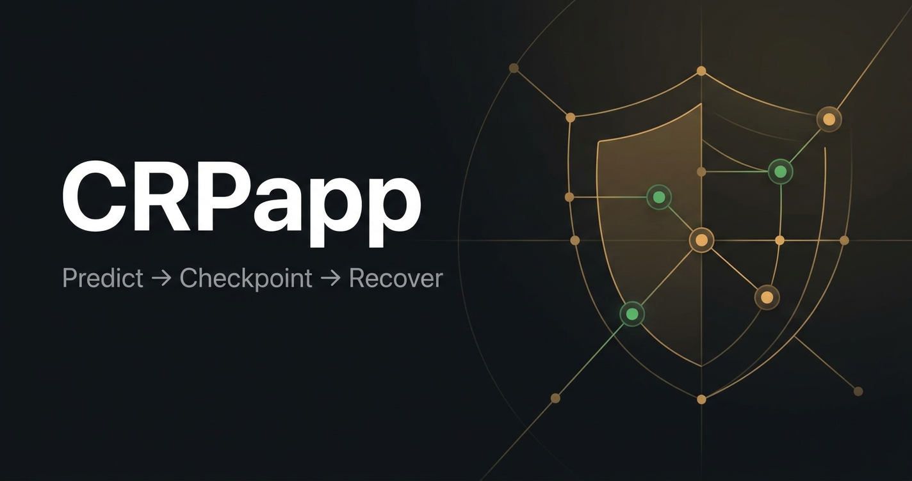
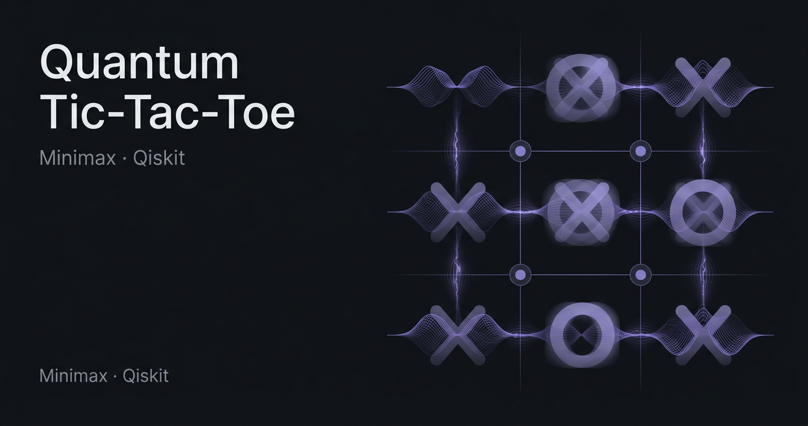

<div align="center">


<br>

<a href="https://readme-typing-svg.demolab.com?font=JetBrains+Mono&weight=500&size=22&pause=1200&color=9AA0A6&center=true&vCenter=true&width=700&lines=Simulations+Engineer;Game+AI+%26+Real-time+Multiplayer;Android+%2F+Kotlin+%E2%80%A2+Web+%2F+Canvas;Clean+code.+Interesting+problems.">
  
</a>

<p>
  <sub>AI · Android · Web — Open Source • Learning</sub>
</p>

<p>
  <a href="https://gvaishanth.github.io/Velocity/"></a>
  <a href="https://gvaishanth.github.io/Computer-Cricket/game.html"></a>
  
</p>

</div>

<br>

---

### About

<table>
<tr>
<td width="58%" valign="top">

I'm a software engineer who builds end-to-end. Interactive simulations, real-time multiplayer games, resilient Android apps, data tools.

I like problems with hard systems constraints — networking, game AI, physics, 60fps UI, state recovery. If it feels good to use, I did my job.

I ship in public, learn continuously, and keep the code clean.

<br>

<strong>Focus areas</strong><br>
Simulations · Game AI · Real-time Multiplayer · Android / Kotlin · Data analysis · Broadcast-style UX

</td>
<td width="42%" valign="top">

```console
$ whoami
GVaishanth
software engineer

$ stack --depth
ai, android, web
python, js, kotlin

$ interests
simulations
motorsport/f1
game_design
problem_solving

$ now
building interactive tools
learning continuously
cowboy_coding: true
```
</td>
</tr>
</table>

<br>

### Live demos

<p align="center">
<a href="https://gvaishanth.github.io/Velocity/"></a>&nbsp;&nbsp;
<a href="https://gvaishanth.github.io/Computer-Cricket/game.html"></a>
</p>
<p align="center"><sub>No install. Opens in browser. 60fps.</sub></p>

<br>

---

### Featured work

<table>
<tr>
<td width="50%" valign="top">

<a href="https://github.com/GVaishanth/Velocity">

</a>

<strong>Velocity — F1 Constructor Championship</strong>
<br>
<sub>JavaScript · Canvas · WebRTC</sub>

<p>Elite, serverless F1 management & racing sim. 60fps Canvas, 22 subsystems.</p>

<ul>
<li>Host-authority P2P multiplayer — 12 drivers · PeerJS</li>
<li>Pit lane physics, thermal simulation, VSC / Red Flags</li>
<li>Livery Studio, R&D, Hall of Glory historic scenarios</li>
<li>ES6 modules, pure CSS, no backend</li>
</ul>

<a href="https://gvaishanth.github.io/Velocity/">Play →</a> · <a href="https://github.com/GVaishanth/Velocity">Code →</a>

</td>
<td width="50%" valign="top">

<a href="https://github.com/GVaishanth/Computer-Cricket">

</a>

<strong>Computer Cricket — Hand Cricket Club</strong>
<br>
<sub>Python · JavaScript · PeerJS</sub>

<p>Number-based cricket in three forms: Python CLI, single-player web, real-time tournament.</p>

<ul>
<li>7 rule modes: Normal, Crazy, Insane, Mad, Noway, B10, Test</li>
<li>IPL-style league + knockouts, 2–12 players, team draft</li>
<li>Live spectating with reactions, toss quiz, career stats</li>
<li>Season Mode, achievements, broadcast-style UI</li>
</ul>

<a href="https://gvaishanth.github.io/Computer-Cricket/game.html">Play →</a> · <a href="https://github.com/GVaishanth/Computer-Cricket">Code →</a>

</td>
</tr>
<tr>
<td width="50%" valign="top">
<br>

<a href="https://github.com/GVaishanth/CRPapp">

</a>

<strong>CRPapp — Predictive Crash Resilience</strong>
<br>
<sub>Kotlin · Android · Proto DataStore</sub>

<p>A PDF workspace built to demonstrate fail-safe resilience, not just read files.</p>

<ul>
<li>Predict → Checkpoint → Recover — 1 Hz health monitoring</li>
<li>Atomic session checkpoints via Protocol Buffers</li>
<li>Chrome-style multi-tab workspace, instant restore</li>
<li>Material Design 3, v4.2.0 Flagship GUI</li>
</ul>

<a href="https://github.com/GVaishanth/CRPapp">Code →</a>

</td>
<td width="50%" valign="top">
<br>

<a href="https://github.com/GVaishanth/Quantum-Tic-Tac-Toe">

</a>

<strong>Quantum Tic-Tac-Toe</strong>
<br>
<sub>Python · Qiskit · Minimax</sub>

<p>Classical Tic-Tac-Toe with non-deterministic quantum state resolution.</p>

<ul>
<li>Qiskit / Qiskit Aer circuits — H, Z, X gate encoding</li>
<li>Multi-shot simulation for final board state</li>
<li>Minimax AI with Alpha-Beta pruning</li>
<li>PvP / PvC modes</li>
</ul>

<a href="https://github.com/GVaishanth/Quantum-Tic-Tac-Toe">Code →</a>

</td>
</tr>
</table>

<br>

<details>
<summary><strong>More projects</strong></summary>
<br>

| Project | What it does | Stack |
|---|---|---|
| **GroupDNA** | WhatsApp Chat Analyzer — “Spotify Wrapped for your WhatsApp group”. Personality archetypes, response times, heatmaps. | Python, NumPy |
| **Salary_Decoder** | Bangalore Tech Salary Decoder. 1,015-record EDA — cleaning messy CTC formats, role premiums, skill deltas. | Python, Pandas, Seaborn, Jupyter |

</details>

<br>

---

### Tech stack

<div align="center">

<table>
<tr>
<td align="center" width="160">
<br>
<sub><b>Python</b><br>CLI · Data · AI</sub>
</td>
<td align="center" width="160">
<br>
<sub><b>JavaScript</b><br>ES6 · Canvas</sub>
</td>
<td align="center" width="160">
<br>
<sub><b>Kotlin</b><br>Android</sub>
</td>
<td align="center" width="160">
<br>
<sub><b>HTML/CSS</b><br>Grid · Flex</sub>
</td>
</tr>
</table>

<br>

<strong>AI / Data</strong><br>
<sub>Minimax · Alpha-Beta · Qiskit · NumPy · Pandas · Matplotlib · Seaborn · Jupyter</sub>

<br><br>

<strong>Web · Realtime</strong><br>
<sub>HTML5 Canvas · WebRTC · PeerJS · GitHub Pages · Vanilla ES6+</sub>

<br><br>

<strong>Mobile</strong><br>
<sub>Android · Material Design 3 · Proto DataStore · Gradle</sub>

<br><br>

<strong>Tooling</strong><br>
<br>
<sub>Git · GitHub Actions</sub>

</div>

<br>

---

### Now

```
building:  interactive simulations, real-time multiplayer
learning:   game AI, resilient systems architecture  
shipping:   small, polished tools — regularly
```

<br>

### Stats

<div align="center">


<br>


<br><br>


</div>

<br>

---

### Notes

```
- I build games with 7 rule sets just to see what breaks
- F1 sim has a full thermal model and a livery editor — details matter
- Vanilla JS + Canvas over frameworks for simulation work
- "Cowboy Coding" — ship fast, then clean it up properly
- Broadcast / telemetry UI is a recurring theme
```

<br>

<div align="center">

> <em>“Championships are engineered.”</em><br>
> <sub>— Velocity</sub>

<br>

---

<a href="https://github.com/GVaishanth">

</a>

<br><br>
<sub>AI · Android · Web</sub><br>
<sub>Open Source • Learning</sub>

<br>

<sub><a href="#top">↑ back to top</a></sub>

</div>
