<div align="center"><a name="top"></a>

<picture>
  <source media="(prefers-color-scheme: light)" srcset="assets/banner-hero-light.svg" type="image/svg+xml">
  <source media="(prefers-color-scheme: dark)" srcset="assets/boot-sequence.svg" type="image/svg+xml">
  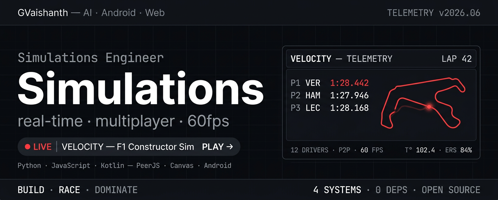
</picture>

</div>

---

I build things to understand how they work — starting with a game loop, a physics tick, or a state machine that needs to survive a crash.

Most of what I ship is interactive — simulations, games, tools people can click — because feedback is immediate and honest. No tests pass like a friend picking it up and figuring it out.

You can't fake a simulation. If the physics are wrong, people notice in the first three seconds.

And I like that.

---

<div align="center">

```
▄▄▄▄▄▄▄▄▄▄▄▄▄▄▄▄▄▄▄▄▄▄▄▄▄▄▄▄▄▄▄▄▄▄▄▄▄▄▄▄▄▄▄▄▄▄▄▄▄▄▄▄▄▄▄
  THE STACK — what's installed
▀▀▀▀▀▀▀▀▀▀▀▀▀▀▀▀▀▀▀▀▀▀▀▀▀▀▀▀▀▀▀▀▀▀▀▀▀▀▀▀▀▀▀▀▀▀▀▀▀▀▀▀▀▀▀
```

</div>

> **`[01]`** Simulations & game systems → Canvas · ES6 · game loops
>
> **`[02]`** Real-time multiplayer → WebRTC · PeerJS · host-authority · 12 players, 0 servers
>
> **`[03]`** Game AI → Minimax · Alpha-Beta · quantum state resolution
>
> **`[04]`** Resilient systems → Proto DataStore · checkpoint/recover
>
> **`[05]`** Data as story → NumPy · Pandas · Seaborn
>
> **`[06]`** Motorsport engineering → telemetry · lap data · race strategy
>
> **`[07]`** Polished tools → things people actually want to play with

I enjoy building things where someone's face changes when they see it work. A kid playing hand cricket against an AI, losing three times before they figure out the pattern. A friend joining a 12-player lobby, realizing the physics feel right.

That's the metric. Not installs, not stars — the moment it clicks.

---

<div align="center">

<sub>TELEMETRY</sub>


</div>

<sub>Six repos in eight months. Regenerates every six hours — not manually updated, not estimated.</sub>

---

The data confirms what the code already knows. Here is how the system is designed, and what it learned.

<div align="center">

<sub>BLUEPRINTS</sub>

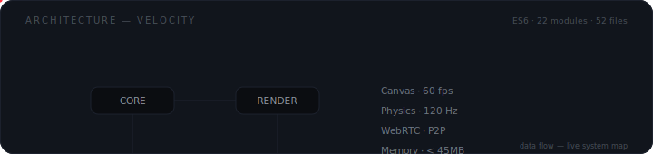
</div>

F1 is already a feedback loop: lap, data, adjustment, next lap. The telemetry aesthetic — timing panels, live tickers, data packets orbiting a closed system — is the accurate visual language for what the code does. Two packets orbit this loop every 4.4 seconds. If any link breaks, they stop. **The animation runs only if every connection is intact.**

Think of it as a heartbeat monitor for the architecture. Flatline means something broke.

<div align="center">
</div>

These aren't aspirational. They're what survived four complete rewrites — each thrown away, each necessary. Not from reading about engineering. From shipping something, watching it break, building it differently. "Cowboy Coding" is about pace, not sloppiness — you can't see the right architecture until you've built the wrong one twice.

---

<div align="center">


</div>

---

<div align="center">

```
▸ FEATURED BUILDS — two simulations, zero installs, zero accounts
```

<br>

<a href="https://github.com/GVaishanth/Velocity">
</a>

<br><br>

<a href="https://github.com/GVaishanth/Computer-Cricket">
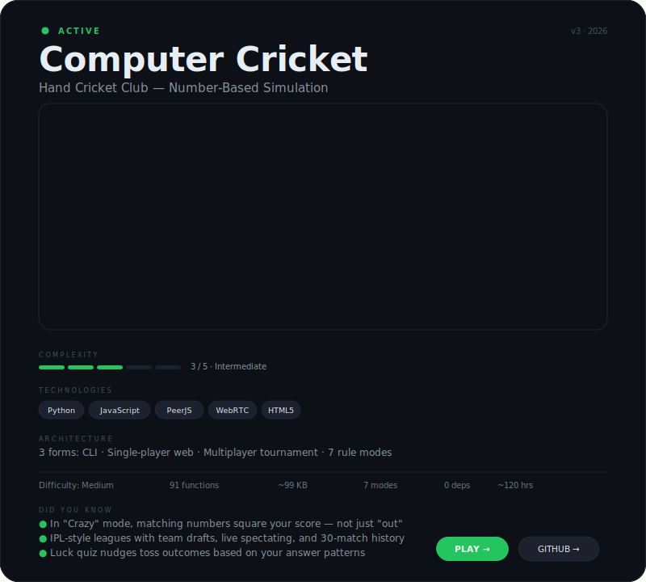
</a>

<br><br>

<details>
<summary><b>Archive</b> — CRPapp · Quantum Tic-Tac-Toe · GroupDNA · Salary_Decoder</summary>

<br>

<a href="https://github.com/GVaishanth/CRPapp">
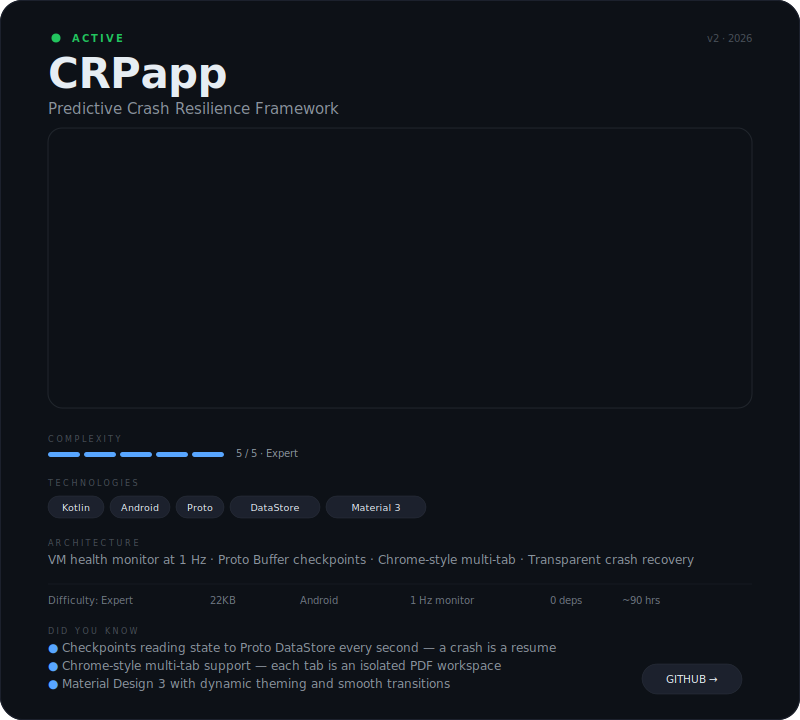
</a>

<br><br>

<a href="https://github.com/GVaishanth/Quantum-Tic-Tac-Toe">
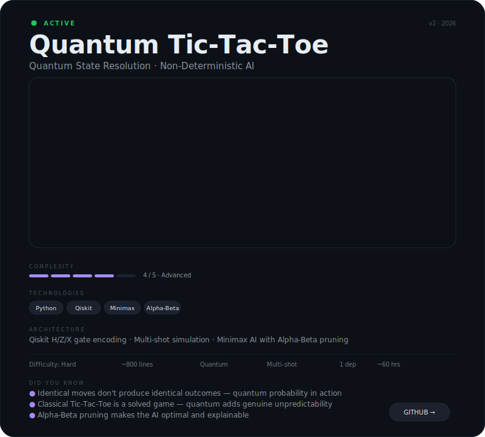
</a>

<br><br>

<a href="https://github.com/GVaishanth/GroupDNA">
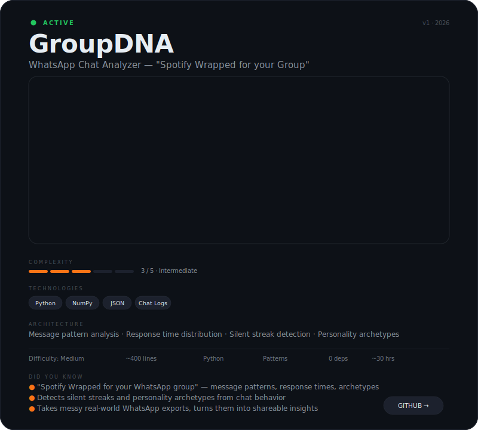
</a>

<br><br>

<a href="https://github.com/GVaishanth/Salary_Decoder">
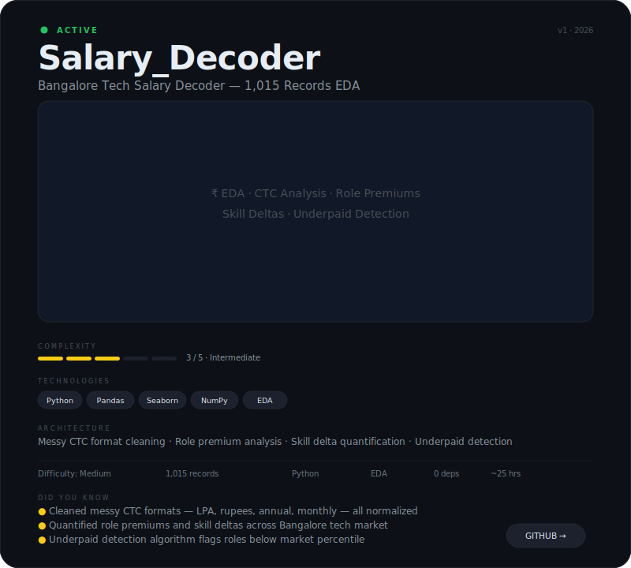
</a>

<br>

</details>

</div>

---

<div align="center">

```
·  ·  ·  ·  →  →  →  →  →  →  →  →  →  →  →  →  →  ·  ·  ·  ·
H O R I Z O N
exploring, not promising
```

</div>

> **Simulations, tighter** — the physics are good enough that you notice when something is slightly wrong. I want to get to the point where you notice when something is exactly right.

> **Multiplayer, larger** — the lobby, spectate, and reconnect infrastructure from Cricket works for 12 players. It doesn't know it's a cricket game. It wants a second use.

> **Deeper motorsport sim** — a full constructor season where tyre temperature changes the fastest lap and the fastest lap changes the championship. One number cascading into everything.

> **Better AI opponents** — a racing AI that doesn't follow a fixed line but learns one. Lap by lap. Getting faster in a way you can actually feel.

> **Data storytelling** — the kind of output someone doesn't explain, they just show their phone. Take a messy export, return something worth a screenshot.

<div align="center">

<br>

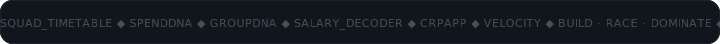

<br><br>

> *Championships are engineered.*
> <br><sub>— Velocity</sub>

<br>

<a href="https://github.com/GVaishanth">github.com/GVaishanth</a>

<br><br>
<sub>Simulations · AI · Android — building in the open</sub>
<br><br>
<sub><a href="#top">↑ top</a></sub>
<br>

</div>
