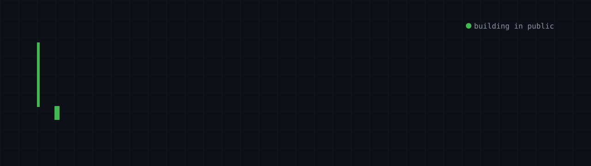

  
  <!-- Self-contained animated SVG. CSS + SMIL only, zero JS, zero external
       assets (a hard GitHub/camo requirement). Static fallback if ever
       needed: assets/profile/hero-systems.png (already in this repo) -->
  

Software developer building **local-first web applications**, **interactive front-ends**, and **mobile tools**.

I like systems whose state you can see. Development environments you can open without an account, multiplayer games with clear rules of authority, and data you can actually interrogate.

`TypeScript` · `JavaScript` · `Kotlin` · `Python` · WebRTC · OPFS / browser storage · Jupyter

---

## Concept spotlight

<!-- AUTO:SPOTLIGHT:START -->
**Adaptive game AI**: **[Computer-Cricket](https://github.com/GVaishanth/Computer-Cricket)** · **[Live ↗](https://gvaishanth.github.io/Computer-Cricket/game.html)**

Hand cricket against an opponent that adapts to your patterns, with house-rule variants from Normal to Insane.

`HTML` · last push 13 Jul 2026

Rotates daily across shipped work. Updated by a scheduled GitHub Action.
<!-- AUTO:SPOTLIGHT:END -->

---

## Flagship: Volt

A local-first development environment that runs entirely in the browser. Workspaces persist in OPFS, so there is no account, no backend, and nothing between you and a running project.

**[Launch the workspace ↗](https://gvaishanth.github.io/Volt/)** · [Source](https://github.com/GVaishanth/Volt) · `TypeScript`

---

## Front-end & multiplayer games

| Project | What it is | Links |
|:--|:--|:--|
| **Velocity** | F1 constructor-championship simulator. Build a team, make strategy calls, and run a full season in the browser. | [Race ↗](https://gvaishanth.github.io/Velocity/) · [Source](https://github.com/GVaishanth/Velocity) |
| **Velvet Stack** | Private, peer-to-peer multiplayer card rooms over WebRTC (PeerJS). Host-authoritative room state, no accounts. | [Open a table ↗](https://gvaishanth.github.io/VelvetStack/) · [Source](https://github.com/GVaishanth/VelvetStack) |
| **Computer Cricket** | Hand cricket with an adaptive AI opponent and house-rule variants (Normal, Crazy, Insane, B10), playable in the browser. | [Play ↗](https://gvaishanth.github.io/Computer-Cricket/game.html) · [Source](https://github.com/GVaishanth/Computer-Cricket) |

## Mobile

| Project | What it is | Links |
|:--|:--|:--|
| **CRPapp** | My first Android app: a predictive crash-resilience framework written in Kotlin. | [Source](https://github.com/GVaishanth/CRPapp) |

## Data & analysis

| Project | What it is | Repository |
|:--|:--|:--|
| **Social Engagement Analysis** | Python tooling for measuring engagement patterns across social platforms. *(actively in progress)* | [Explore →](https://github.com/GVaishanth/Social_Engagement_Analysis) |
| **Salary Decoder** | Notebook that decodes compensation (CTC) structures into real take-home components. | [Explore →](https://github.com/GVaishanth/Salary_Decoder) |
| **SpendDNA** | Exploratory analysis and visual storytelling over personal spending data. | [Explore →](https://github.com/GVaishanth/SpendDNA) |
| **GroupDNA** | Group-chat analysis: participation, activity rhythms, and conversation dynamics. | [Explore →](https://github.com/GVaishanth/GroupDNA) |
| **RedFlag: Fraud Detection** | Exploring red-flag heuristics and models for fraudulent-transaction detection. | [Explore →](https://github.com/GVaishanth/RedFlag-Fraud-Detection) |

## Experiments

- **[Re-OS](https://github.com/GVaishanth/Re-OS)**: experimental desktop environment that runs entirely in the browser.
- **[Quantum Tic-Tac-Toe](https://github.com/GVaishanth/Quantum-Tic-Tac-Toe)**: tic-tac-toe with superposition and entanglement rules.
- **[Squad Timetable](https://github.com/GVaishanth/Squad_Timetable)**: collaborative timetable and scheduling tool.

---

## Recently active

<!-- AUTO:RECENT:START -->
| Project | Focus | Last push |
|:--|:--|:--|
| **[CheckMate](https://github.com/GVaishanth/CheckMate)** ([demo ↗](https://gvaishanth.github.io/CheckMate/)) | A modern chess platform built for everyone. Play live matches, test your strategy, and sharpen your chess knowledge. | 13 Sep 2026 |
| **[ADAS](https://github.com/GVaishanth/ADAS)** | Advanced Driver Assistance Systems | 07 Sep 2026 |
| **[Social_Engagement_Analysis](https://github.com/GVaishanth/Social_Engagement_Analysis)** | Project | 05 Sep 2026 |
| **[Volt](https://github.com/GVaishanth/Volt)** ([demo ↗](https://gvaishanth.github.io/Volt/)) | VOLT is a 100% local-first, browser-native development operating environment and desktop experience. Designed entirely for the web, it runs completely client-side with zero backend dependencies, zero telemetry, and zero cloud fallbacks. | 01 Aug 2026 |
| **[Squad_Timetable](https://github.com/GVaishanth/Squad_Timetable)** ([demo ↗](https://gvaishanth.github.io/Squad_Timetable/)) | A fully offline, single-file HTML timetable tracker built for VIT Vellore students following the FFCS (Fully Flexible Credit System) scheduling format. | 30 Jul 2026 |

**Active over the last 90 days:** `TypeScript` · `Python` · `HTML` · `JavaScript` · `Jupyter Notebook` · `Kotlin`

Refreshed daily from public GitHub activity · excludes automated commits to this profile repo.
<!-- AUTO:RECENT:END -->

  

### Contact

- GitHub: [@GVaishanth](https://github.com/GVaishanth)
- Location: Chennai, India
- Education: B.Tech CSE @ VIT Vellore

<!-- Add LinkedIn / email / portfolio links here when available. -->

[↑ Back to top](#top)
