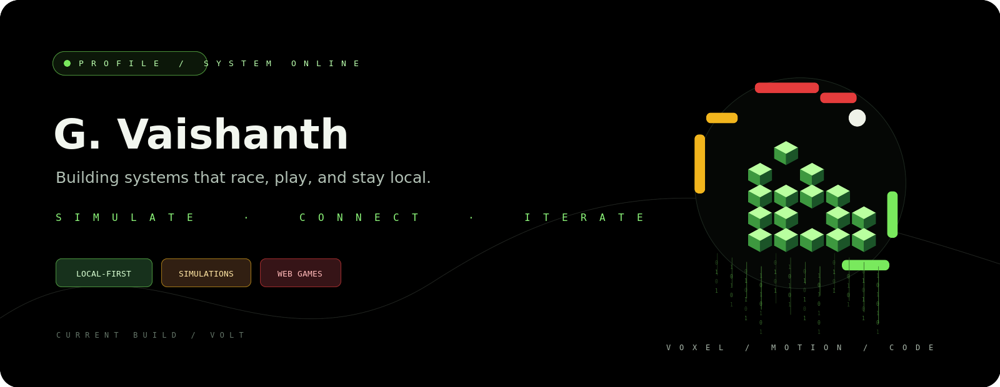
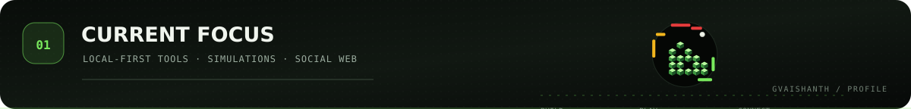
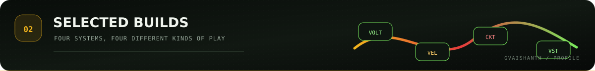
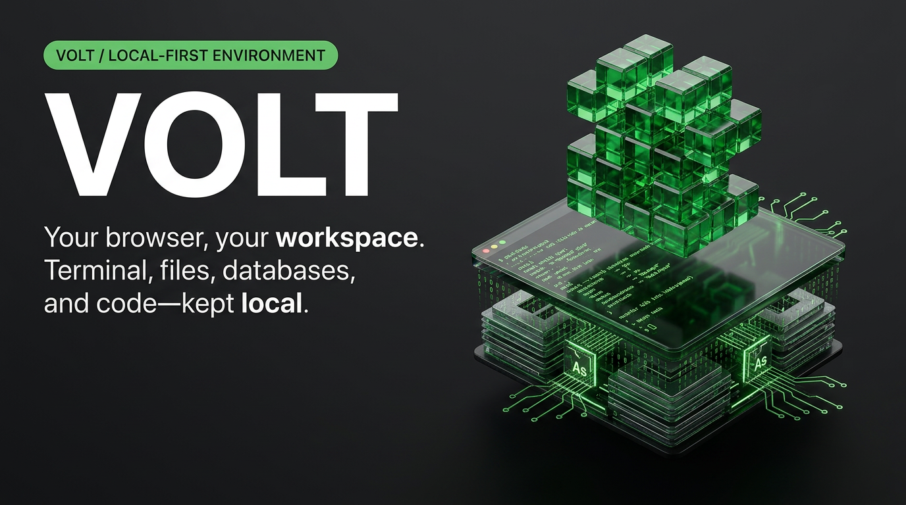
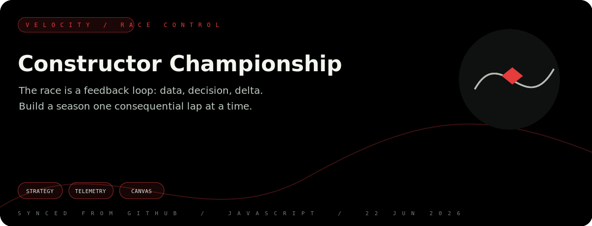
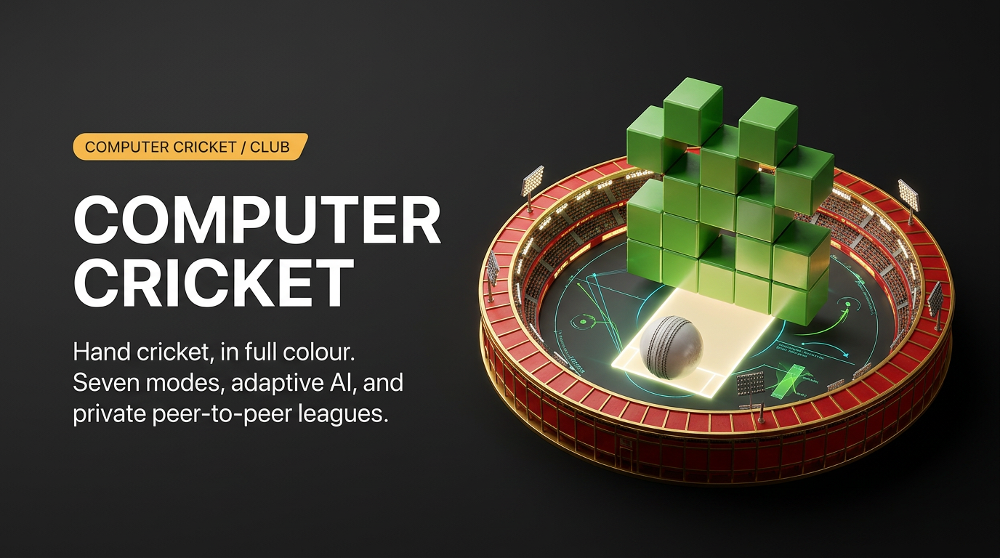
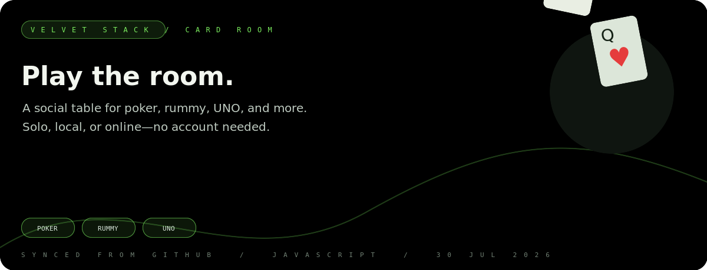
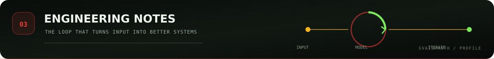
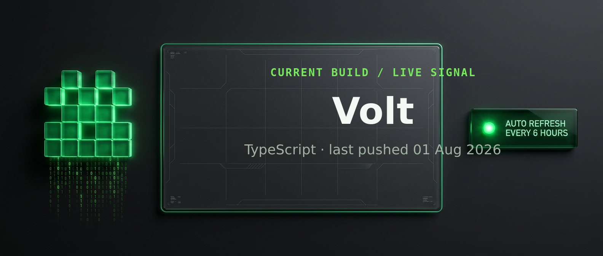

<div align="center">
  <a id="top"></a>
  <picture>
    <source srcset="assets/profile/hero-systems.svg" type="image/svg+xml">
    
  </picture>

  <br>
  <sub><b>B.Tech CSE @ VIT Vellore</b> · Interactive systems · Local-first web apps · AI & data</sub>
</div>

---

I’m **G. Vaishanth**. I build browser-native products that invite people to try them: a racing championship where strategy compounds over a season, a cricket game with an adaptive opponent, a private card room, and now a local-first development environment.

The common thread is **systems with feedback**. A good game loop, a durable state model, useful local persistence, and an interface that makes the underlying rules feel legible all matter more to me than a static demo.

> **Build it. Click it. Break it. Make the next iteration better.**

## Current focus



| | Building | What it means in practice |
|:--|:--|:--|
| ⚡ | **Local-first tools** | Browser software that keeps work on the device and remains useful without a backend. |
| 🎮 | **Interactive simulations** | Game loops, state machines, strategy, progression, and systems players can actually feel. |
| 🌐 | **Social browser experiences** | Private rooms and peer-to-peer play built around WebRTC / PeerJS rather than accounts. |
| 📊 | **Data with a point of view** | Turning messy inputs, telemetry, and chat data into clear, useful stories. |

## Selected builds



### ⚡ [Volt — Local-First Development Operating Environment](https://gvaishanth.github.io/Volt/)
<a href="https://gvaishanth.github.io/Volt/">
  <picture>
    <source srcset="assets/profile/card-volt.svg" type="image/svg+xml">
    
  </picture>
</a>

**A desktop-like development workspace that runs entirely in the browser.** Volt is built around local storage and browser capabilities—not a cloud backend—with an OPFS / IndexedDB-backed virtual filesystem, a terminal, editor, file explorer, web preview and API client, SQLite workspace, local Git simulation, and task manager.

[`Live workspace ↗`](https://gvaishanth.github.io/Volt/) · [`Source code`](https://github.com/GVaishanth/Volt) · `TypeScript` `WebAssembly` `Web Workers` `OPFS` `IndexedDB`

### 🏁 [Velocity — Constructor Championship](https://gvaishanth.github.io/Velocity/)
<a href="https://gvaishanth.github.io/Velocity/">
  <picture>
    <source srcset="assets/profile/card-velocity.svg" type="image/svg+xml">
    
  </picture>
</a>

**Build. Race. Dominate.** An F1 constructor championship simulator focused on racing strategy, telemetry, tyre and weather decisions, historical scenarios, and broadcast-style race presentation. It is a simulation where the consequences of a decision carry forward rather than disappear after a lap.

[`Race now ↗`](https://gvaishanth.github.io/Velocity/) · [`Source code`](https://github.com/GVaishanth/Velocity) · `JavaScript` `Canvas` `Game systems`

### 🏏 [Computer Cricket — Hand Cricket Club](https://gvaishanth.github.io/Computer-Cricket/game.html)
<a href="https://gvaishanth.github.io/Computer-Cricket/game.html">
  <picture>
    <source srcset="assets/profile/card-cricket.svg" type="image/svg+xml">
    
  </picture>
</a>

**Seven modes. One honest scoreboard.** A hand-cricket game with solo play against an adaptive CPU, persistent local profiles and career history, season mode, and private peer-to-peer leagues for up to 12 players. Modes range from classic hand cricket to short B10 sprints and two-innings Test matches.

[`Play the Nets ↗`](https://gvaishanth.github.io/Computer-Cricket/game.html) · [`Source code`](https://github.com/GVaishanth/Computer-Cricket) · `HTML` `CSS` `JavaScript` `PeerJS` `WebRTC`

### ♠️ [Velvet Stack — The Social Card Room](https://gvaishanth.github.io/VelvetStack/)
<a href="https://gvaishanth.github.io/VelvetStack/">
  <picture>
    <source srcset="assets/profile/card-velvet.svg" type="image/svg+xml">
    
  </picture>
</a>

**One table. Every game.** A browser-native card-game collection with Texas Hold’em, Rummy, and UNO. Play solo against bots, share a device for local play, or open a private online room for friends—without accounts or a traditional backend.

[`Choose a table ↗`](https://gvaishanth.github.io/VelvetStack/) · [`Source code`](https://github.com/GVaishanth/VelvetStack) · `JavaScript` `PeerJS` `WebRTC` `GitHub Pages`

---

## Engineering notes



```text
INPUT → MODEL → FEEDBACK → ITERATION
```

- **The interface is part of the system.** A rules-heavy game or tool only works when someone can understand its state at a glance.
- **Local-first is a product decision.** Keeping profiles, workspaces, saves, and progress in the browser makes a project immediate to try and resilient by default.
- **Multiplayer needs clear authority.** Private peer-to-peer rooms are most dependable when one host owns the room state and every action is explicit.
- **Polish exposes flaws early.** Animations, timing panels, and real user input reveal state and logic bugs that a happy-path demo hides.

## More from the workshop


| Project | Area | Repository |
|:--|:--|:--|
| **Re-OS** | Browser desktop / operating-system experiments | [Explore →](https://github.com/GVaishanth/Re-OS) |
| **Squad Timetable** | Collaborative timetable tooling | [Explore →](https://github.com/GVaishanth/Squad_Timetable) |
| **CRPapp** | Predictive crash-resilience framework for Android | [Explore →](https://github.com/GVaishanth/CRPapp) |
| **Quantum Tic-Tac-Toe** | Quantum-state twist on a classic game | [Explore →](https://github.com/GVaishanth/Quantum-Tic-Tac-Toe) |
| **RedFlag Fraud Detection** | Fraud-detection exploration | [Explore →](https://github.com/GVaishanth/RedFlag-Fraud-Detection) |
| **SpendDNA · GroupDNA · Salary Decoder** | Data exploration and visual storytelling | [SpendDNA](https://github.com/GVaishanth/SpendDNA) · [GroupDNA](https://github.com/GVaishanth/GroupDNA) · [Salary Decoder](https://github.com/GVaishanth/Salary_Decoder) |

## Now shipping

<div align="center">
  <picture>
    <source srcset="assets/profile/current-build.svg" type="image/svg+xml">
    
  </picture>
  <br>
  <sub>Project activity, current build, and featured-card metadata refresh from public GitHub data every six hours.</sub>
</div>

---

<div align="center">

**[GitHub](https://github.com/GVaishanth)** · **[Volt](https://gvaishanth.github.io/Volt/)** · **[Velocity](https://gvaishanth.github.io/Velocity/)** · **[Computer Cricket](https://gvaishanth.github.io/Computer-Cricket/game.html)** · **[Velvet Stack](https://gvaishanth.github.io/VelvetStack/)**

<sub>Building in the open · from systems that race to tools that stay local</sub>

[↑ top](#top)
</div>
